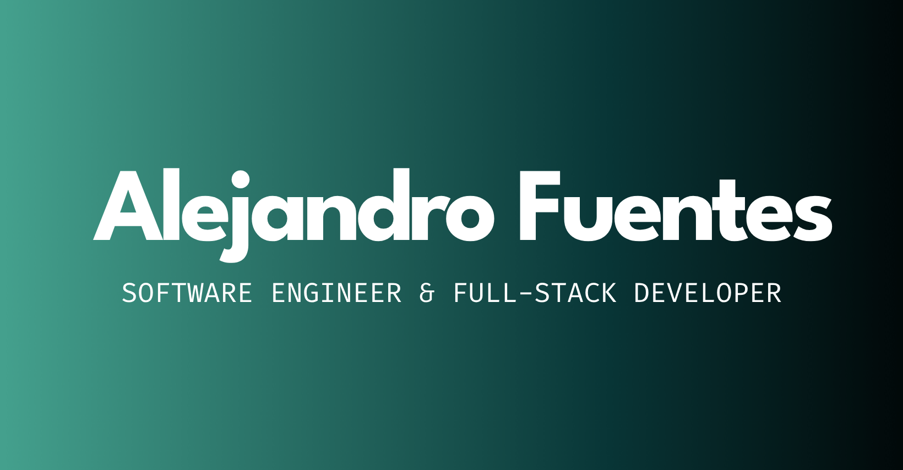

<section class="bento-grid" style="display:grid;gap:1rem;grid-template-areas:'hero-section hero-section hero-section hero-section' 
                            'about-section about-section skills-section skills-section'
                            'experience-section experience-section experience-section hobbies-section'
                            ' footer-section  footer-section footer-section hobbies-section'">
<!-- HERO SECTION -->

<!-- ABOUT SECTION -->

<h1 style="color:white;margin: 1rem;">About</h1>

<!-- SKILLS SECTION-->

<h1 style="color:white;margin: 1rem;">Skills</h1>

<!-- EXPERIENCE SECTION -->

<!-- HOBBIES SECTION -->

<h1 style="color:white;margin: 1rem;">Hobbies</h1>
<ul style="list-style-type: none;">
<li style="display:flex;flex-direction: row;gap:1rem;align-items: start;color:white;">
Running
</li>
<li style="display:flex;flex-direction: row;gap:1rem;align-items: start;color:white;"> 
Reading
</li>
<li style="display:flex;flex-direction: row;gap:1rem;align-items: start;color:white;">
Gym
</li>
<li style="display:flex;flex-direction: row;gap:1rem;align-items: start;color:white;">
Cooking
</li>
<li style="display:flex;flex-direction: row;gap:1rem;align-items: start;color:white;"> 
Travelling
</li>
<li style="display:flex;flex-direction: row;gap:1rem;align-items: start;color:white;">
Football
</li>
<li style="display:flex;flex-direction: row;gap:1rem;align-items: start;color:white;">
Coding
</li>
</ul>

<!-- FOOTER SECTION -->

</section>

<!--
**alefuegom/alefuegom** is a ✨ _special_ ✨ repository because its `README.md` (this file) appears on your GitHub profile.

Here are some ideas to get you started:

- 🔭 I’m currently working on ...
- 🌱 I’m currently learning ...
- 👯 I’m looking to collaborate on ...
- 🤔 I’m looking for help with ...
- 💬 Ask me about ...
- 📫 How to reach me: ...
- 😄 Pronouns: ...
- ⚡ Fun fact: ...
-->
